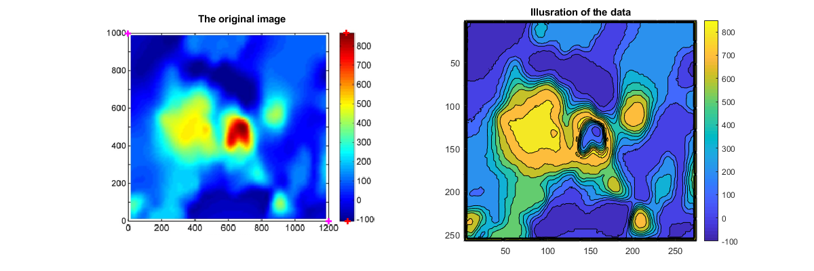

# EDFI
EDFI is a script to extract data from an 2D or 3D image. 
EDFI is developed using MATLAB and these steps below:
1. Load image. I get this image from [here](http://jme.shahroodut.ac.ir/article_953_0.html)
2. Get data from image. 
3. Plot result.

</img>
